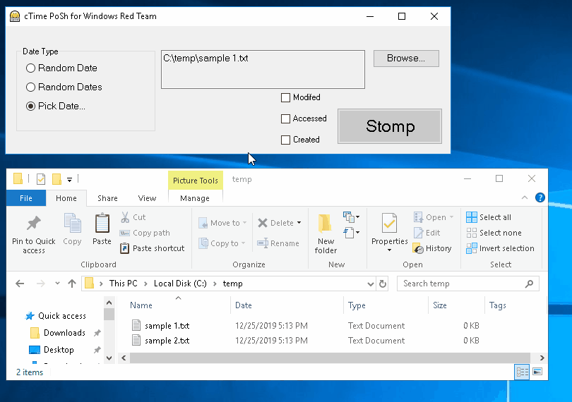
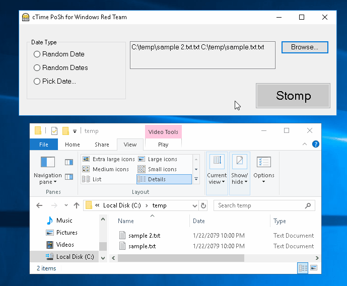
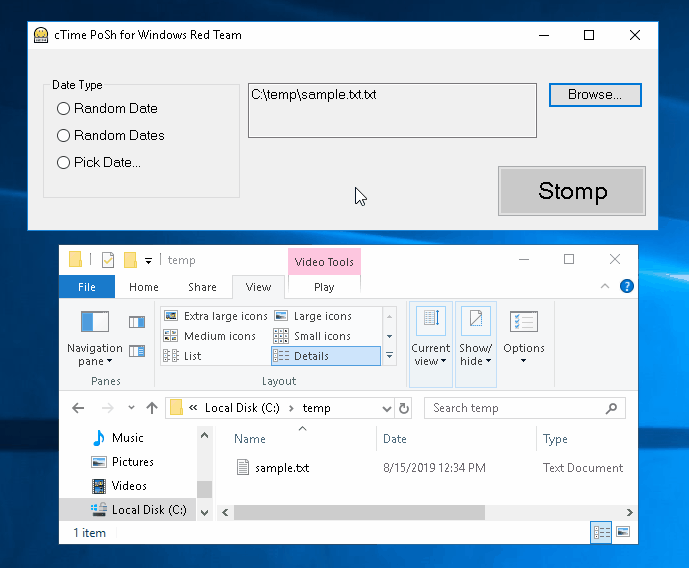

# ClobberTime PoSh

## Table of Contents
* [Intro](#intro)
* [Supported Operations](#operations)
* [Example Use Cases](#use-cases)
* [Demo](#demo)

### Intro
ClobberTime PoSH is a graphical frontend that provides functionality for manipulation of MAC (Modified, Accessed, Created) timestamps during Windows Red Team or Pentesting engagements, without modifying current system time and without invoking the traditional timestomp binary.  Extends the functionality of the Timestomp module located in https://github.com/vhoudoverdov/Security-Utils/

This utility can be wrapped in a binary (exe) and signed with a forged software-signing certificate for additional evasion.

##### Author
Vasken Houdoverdov  - github.com/vhoudoverdov

### Supported Operations

| Operation | Description |
| --- | --- |
| **'Timestomp' target file(s) with a single random date** | This operation will generate a single random DateTime object and set each selected MAC property of each target file to this date. |
| **'Timestomp' target file(s) with multiple random dates** | This operation will generate multiple new random DateTime objects, one for each selected MAC property of each target file.  The result of this operation is that each selected MAC property of each target file will be set to a random date. 
 | **'Timestomp' target file(s) with a specified date** | This operation will ask the user to specify a datetime using an on-screen calendar, them timestomp the selected MAC properties of each target file with the specified date.|

### Example Use Cases
Timestamp manipulation in Windows can be used in a variety of educational use cases:
##### Demonstrating the relationship between userland timestamps and timestamps in the MFT
Modern Windows filesystem implementations (NTFS) store two 'groups' of timestamps for each filesystem object.  The two groups of timestamps are stored in the attributes $STANDARD_INFORMATION and $FILE_NAME.  

| Attribute | Description |
| --- | --- |
| **$STANDARD_INFORMATION** | Accessible to standard Windows API libraries, and can be modified by user-level processes. |
| **$FILE_NAME** | Kernel-accessible. 

Typically, utilities that 'timestomp' files in user space (like ClobberTime PoSH or the traditional timestomp binary), will only manipulate the timestamps stored in the $STANDARD_INFORMATION attribute, since the $FILE_NAME attribute is typically only kernel-accessible.  The consequence of this is that there will be a discrepancy between the timestamps stored in each of the two attributes, indicating that timestamp manipulation may have occurred.

##### Disguising WebShells or backdoors during Red Team engagements
A typical Windows Red Team engagement may involve dropping one or more files onto a target host for persistence.  Manipulation of the userland timestamps of these files may allow them to superficially resemble an expected component of the directory they are embedded in.

##### Software Development Testing
A number of use cases in software development that rely on timestamp validation can be facilitated using a tool that allows for the setting of arbitrary timestamps across one or more files.

### Demo
###### Timestomp MAC properties of a single file with a random date

###### Timestomp MAC properties of multiple files with multiple random dates

###### Timestomp MAC properties of a single file with a specified date. 

