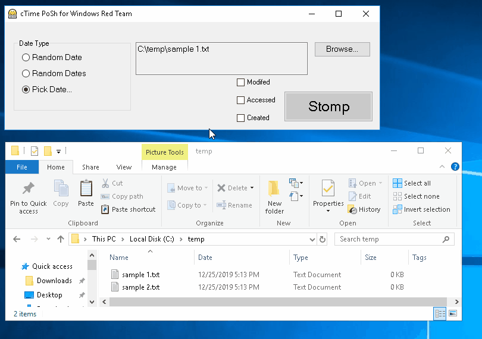

# ClobberTime

## Table of Contents
* [Intro](#intro)
* [Supported Operations](#operations)
* [Example Use Cases](#use-cases)
* [Demo](#demo)
* [Forensic Analysis and Detection](#forensics)
### <a name="intro"></a>Intro
ClobberTime is a graphical frontend that provides functionality for the manipulation of MAC (Modified, Accessed, Created) timestamps during Windows Red Team or Pentesting engagements, without modifying current system time and without invoking the traditional timestomp binary.  It is also designed as an education tool to demonstrate the difference between userland timestamps (which can be easily manipulated) and timestamps recorded in the filesystem MFT.

Extends the functionality of the Timestomp-Utils module located in https://github.com/vhoudoverdov/Security-Utils/

This utility can be wrapped in a binary (exe) and signed with a forged software-signing certificate for additional evasion.

##### Author
Vasken Houdoverdov  - github.com/vhoudoverdov

### <a name="operations"></a>Supported Operations

| Operation | Description |
| --- | --- |
| **'Timestomp' target file(s) with a single random date** | This operation will generate a single random DateTime object and set each selected MAC property of each target file to this date. |
| **'Timestomp' target file(s) with multiple random dates** | This operation will generate multiple new random DateTime objects, one for each selected MAC property of each target file.  The result of this operation is that each selected MAC property of each target file will be set to a random date. 
 | **'Timestomp' target file(s) with a specified date** | This operation will ask the user to specify a datetime using an on-screen calendar, then set each selected MAC property of each target file to the specified date.|

### <a name="use-cases"></a>Example Use Cases
Timestamp manipulation in Windows can be used in a variety of educational use cases:
#### Demonstrating the relationship between userland timestamps and timestamps in the MFT
Modern Windows filesystem implementations (NTFS) store two 'groups' of timestamps for each filesystem object.  The two groups of timestamps are stored in the attributes **$STANDARD_INFORMATION** and **$FILE_NAME**.  

**$STANDARD_INFORMATION** - Accessible to standard Windows API libraries, and can be modified by user-level processes. 
**$FILE_NAME** - Kernel-accessible. 

Typically, utilities that 'timestomp' files in user space (like ClobberTime PoSH or the traditional timestomp binary), will only manipulate the timestamps stored in the **$STANDARD_INFORMATION** attribute, since the **$FILE_NAME** attribute is typically only kernel-accessible.  The consequence of this is that there will be a discrepancy between the timestamps stored in each of the two attributes, indicating that timestamp manipulation may have occurred.

#### Disguising WebShells or backdoors during Red Team engagements
A typical Windows Red Team engagement may involve dropping one or more files onto a target host for persistence.  Manipulation of the userland timestamps of these files may allow them to superficially resemble an expected component of the directory they are embedded in.

#### Software Development Testing
A number of use cases in software development that rely on timestamp validation can be facilitated using a tool that allows for the setting of arbitrary timestamps across one or more files.

### <a name="demo"></a>Demo
###### Timestomp MAC properties of a single file with a random date



###### Timestomp MAC properties of multiple files with multiple random dates


###### Timestomp MAC properties of a single file with a specified date. 


### <a name="forensics"></a>Forensic Analysis and Detection
If timestamps are modified in userland, it is necessary to refer to the **$FILE_NAME** attribute in the filesystem Master File Table (MFT) in order to obtain accurate timestamp information for the purposes of sound forensic analysis.

A number of mechanisms exist that allow the **$FILE_NAME** attribute for a given file to be queried directly from the MFT.  One such module is the [PowerForensics module](https://github.com/Invoke-IR/PowerForensics) for PowerShell.  A demonstration of using this module to return timstamps stored in the MFT is presented here.

##### Scenario
Suppose a persistence mechanism (webshell) has been dropped on the local system at C:\temp\sample.html.  The MAC timestamps of this file were modified in userland by the adversary to match the dates of other files in the directory (in this case, February 2009), but were actually planted into the filesystem in December 2019.

Loading the PowerForensics module and querying for the **$FILE_NAME** attribute reveals the timestamp discrepancy:
```
> Get-Location

Path
----
C:\temp

> Import-Module .\PowerForensics-master\Modules\PowerForensics\PowerForensics.psm1
> Get-Command -Module PowerForensics *FileRecord*

CommandType     Name                                               Version    Source
-----------     ----                                               -------    ------
Function        Get-ForensicFileRecord                             0.0        PowerForensics
Function        Get-ForensicFileRecordIndex                        0.0        PowerForensics


> (Get-ForensicFileRecord C:\temp\sample.html).Attribute


BornTime             : 2/13/2009 8:31:17 PM
ModifiedTime         : 2/13/2009 8:31:17 PM
ChangedTime          : 12/27/2019 2:59:04 AM
AccessedTime         : 2/13/2009 8:31:17 PM
Permission           : ARCHIVE
MaxVersionNumber     : 0
VersionNumber        : 0
ClassId              : 0
OwnerId              : 0
SecurityId           : 2617
QuotaCharged         : 0
UpdateSequenceNumber : 3749119560
Name                 : STANDARD_INFORMATION
NameString           :
AttributeId          : 0

Filename             : sample.html
ParentSequenceNumber : 10
ParentRecordNumber   : 126390
Namespace            : 1
AllocatedSize        : 1089536
RealSize             : 1089217
Flags                : 32
ER                   : 0
ModifiedTime         : 12/27/2019 2:44:50 AM
AccessedTime         : 12/22/2019 6:30:05 AM
ChangedTime          : 12/22/2019 6:31:48 AM
BornTime             : 12/22/2019 6:14:37 AM
Name                 : FILE_NAME
NameString           :
AttributeId          : 9
```
